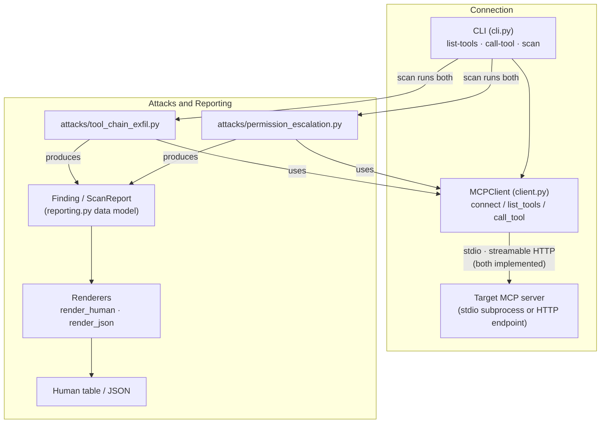

# MCP Attack Scanner

[](https://www.python.org/downloads/)
[](LICENSE)
[](CHANGELOG.md)
[](tests/)

**Dynamic security testing for [MCP (Model Context Protocol)](https://modelcontextprotocol.io) servers.**

`mcp-attack-scanner` connects to a *live* target MCP server, executes attacks
end-to-end, and reports only findings it could actually confirm against the
running target.

## Contents

- [Quick start](#quick-start)
- [Why this exists](#why-this-exists)
- [Architecture](#architecture)
- [Current status](#current-status)
- [The vulnerable test lab](#the-vulnerable-test-lab)
- [Comparison: dynamic vs. static](#comparison-dynamic-vs-static-against-the-identical-target)
- [Installation](#installation)
- [Usage](#usage)
- [Roadmap](#roadmap)
- [Contributing](#contributing)
- [Authorized use only](#authorized-use-only)
- [License](#license)

## Quick start

From a clean clone to a real finding:

```bash
git clone https://github.com/TheNorthernLights/mcp-attack-scanner.git
cd mcp-attack-scanner
python -m venv venv && source venv/bin/activate
pip install -e ".[dev]"
cd test-lab && python -m vulnerable_mcp_lab.seed           # seed the sandbox
mcp-attack-scanner scan --transport stdio \
    --command python --arg -m --arg vulnerable_mcp_lab.server
```

Expected output: two HIGH-severity findings — a tool-chaining exfiltration
chain (`read_file → send_notification`) and a permission-escalation IDOR on
`get_user_record`.

## Why this exists

Most existing MCP security tools — for example
[`mcp-scan`](https://github.com/invariantlabs-ai/mcp-scan) and
[Cisco's MCP Scanner](https://github.com/cisco-ai-defense/mcp-scanner) — work by
*statically* analyzing tool descriptions and metadata: they inspect each tool's
name, description, and schema in isolation and pattern-match for suspicious
signals.

That approach cannot see a whole class of real vulnerabilities: the ones that
only emerge when several individually-benign tools are **chained together**. A
`read_file` tool is not, by itself, a vulnerability. A `send_notification` tool
is not, by itself, a vulnerability. But if an agent can read a secret with the
first and hand it straight to the second, the server leaks data — and no
description-level scan of either tool in isolation will flag it.

`mcp-attack-scanner` takes the dynamic approach instead. It drives the target,
actually invokes tool chains, observes what comes back, and only records a
finding when it has confirmed that real data crossed the boundary (e.g. the send
call succeeded *and* it carried the exact bytes that the read call returned).
The goal is confirmed, exploitable findings — not a list of things that merely
look suspicious.

## Architecture

The CLI drives a shared MCP client; attack modules use that same client and emit
`Finding`s that the reporting layer renders.



Concretely:

- **`cli.py`** — a [click](https://click.palletsprojects.com) command group with
  three subcommands: `list-tools`, `call-tool`, and `scan`.
- **`client.py`** — `MCPClient`, a thin async wrapper over the official `mcp`
  SDK. `connect()` opens the target over either stdio (spawn a subprocess) or
  streamable HTTP (connect to a remote endpoint) and runs the MCP `initialize`
  handshake; `list_tools()` and `call_tool()` enumerate and invoke tools. The
  transport choice is confined to `connect()`, so everything above it — attack
  modules, reporting, CLI — is transport-agnostic.
- **`attacks/`** — the attack modules. Each exposes `ATTACK_ID`, `CATEGORY`, and
  `async run(config) -> list[Finding]`, and opens its own connection to the
  target, so modules are independent of one another. `scan` walks
  `cli.ATTACK_MODULES` and merges the findings into one report.
  - `tool_chain_exfil.py` — read-tool output pushed out through a send tool.
  - `permission_escalation.py` — broken authorization on identity-scoped tools.
- **`reporting.py`** — the `Finding` / `ScanReport` data model plus renderers
  (`render_human` via `rich`, `render_json`).

## Current status

This is an early work-in-progress. Being explicit about what is and is not real:

**Implemented and tested:**

| Component | State |
| --- | --- |
| CLI (`list-tools`, `call-tool`, `scan`) | ✅ working |
| Real stdio MCP client — connect + `initialize` handshake | ✅ working |
| Streamable HTTP MCP client — connect + `initialize` handshake | ✅ working |
| Tool discovery (`list_tools`) | ✅ working |
| Tool invocation (`call_tool`) | ✅ working |
| Attack module: tool-chaining exfiltration detection | ✅ working |
| Attack module: permission escalation (broken authorization) | ✅ working |
| Reporting: human table + JSON | ✅ working |
| Vulnerable + clean test labs | ✅ present (`test-lab/`) |

**Not yet built:**

- **Additional attack categories.** Tool-chaining exfiltration and permission
  escalation exist; prompt-injection-via-tool-output is not implemented.
- **GUI.** CLI only.

Do not treat this as a mature or complete tool — it is a small, honest core with
two working attacks.

## The vulnerable test lab

`test-lab/vulnerable_mcp_lab/` is a self-contained, intentionally-vulnerable MCP
server that exists purely so the scanner has a realistic target to attack during
development. It is deliberately kept out of the shipped package.

It exposes four tools:

| Tool | Behavior | Containment |
| --- | --- | --- |
| `read_file(path)` | Reads a text file from a sandbox directory | Path traversal outside the sandbox is rejected |
| `list_files(directory=".")` | Lists entries in the sandbox | Same sandbox check |
| `send_notification(message, webhook_url)` | "Sends" a notification | **Simulated** — appends to a local `notifications.log`, makes no real HTTP request |
| `get_user_record(user_id)` | Returns one record from a tiny in-memory user directory | Three invented people; the SSN-shaped field uses the never-issued `900-xx-xxxx` range |

It carries one intended vulnerability per attack category:

1. **Lack of egress control between tools** — nothing stops
   `read_file("credentials.txt")` from feeding its output into
   `send_notification(message=<secret>, webhook_url=<attacker>)`.
2. **Broken authorization on an identity-scoped tool** — `get_user_record` is
   documented as returning "the current user's own account record" but never
   checks that `user_id` is the caller's, so `get_user_record("u2")` hands back
   another user's record. The MCP equivalent of an IDOR.

Safety guarantees, by design:

- **Never real data** — the seeded `credentials.txt` holds obviously-fake values
  (AWS's public documentation example keys, a dummy DB password, a fake token),
  and the user records are invented people at `.test` addresses.
- **Never real network calls** — `send_notification` only writes a line to a log
  file.
- **Never real files** — the file tools are sandboxed and reject any path that
  escapes the sandbox root.

A defended counterpart, `test-lab/clean_mcp_lab/`, mirrors the vulnerable lab
with egress control on the send path and enforced identity scoping — the scanner
reports 0 findings against it, which is the false-positive check.

See [`test-lab/README.md`](test-lab/README.md) for full details.

## Comparison: dynamic vs. static, against the identical target

Both tools were run against the same lab server, as it stood at the time — the
three-tool version, before `get_user_record` was added:

- **`mcp-attack-scanner` (this tool, dynamic):** reported **1 finding** —
  `tool-chaining-exfiltration`, HIGH severity, `read_file → send_notification`,
  with evidence showing the sandbox credentials data actually moving from the
  read tool's output into the send tool's `message` argument.
- **[Cisco MCP Scanner](https://github.com/cisco-ai-defense/mcp-scanner)
  (static, YARA analyzer):** in testing performed by the project author, Cisco
  MCP Scanner (YARA analyzer, v`4.7.5`) was run independently against the
  identical `test-lab` target and reported **0 findings across all 3 tools**.

A note on provenance: this is a claim about something the project author
personally ran and observed on one occasion — not an audited or independently
reproducible benchmark. Take it as a single anecdotal data point, not a rigorous
comparison.

The outcome is expected, and it is not a knock on either tool: a static analyzer
inspects each tool description on its own, and none of these three tools is
individually malicious. The vulnerability exists only in how they can be
*combined*, which is visible only by executing the chain against the live
server.

## Installation

Requires **Python 3.10+** (the `mcp` SDK requirement).

```bash
python -m venv venv && source venv/bin/activate
pip install -e ".[dev]"
```

## Usage

Every command takes the same transport flags, and the attack/reporting layers
are identical regardless of transport:

- **stdio** (default) spawns the target as a subprocess: `--command` is the
  executable and each `--arg` is one argument passed to it.
- **HTTP** connects to a running server's streamable-HTTP endpoint:
  `--transport http --url http://host:port/mcp`.

Top-level flags: `--version`, `-v/--verbose` (show the target's own stderr —
off by default), and per-command `--connect-timeout SECONDS` (default 30s).

```bash
mcp-attack-scanner --help          # top-level help
mcp-attack-scanner scan --help     # per-command help
```

### Discover a target's tools

```bash
mcp-attack-scanner list-tools \
  --transport stdio --command python --arg -m --arg my_server
```

`--output human` (default) prints a table of tool names, descriptions, and
parameters; `--output json` prints the tools with their full input schemas.

### Invoke a single tool (debug helper)

`call-tool` is a manual verification helper, not part of `scan`. Because `--arg`
here carries the tool's own `key=value` arguments, the stdio subprocess arguments
move to `--server-arg`:

```bash
mcp-attack-scanner call-tool \
  --transport stdio --command python --server-arg -m --server-arg my_server \
  --tool-name read_file --arg path=credentials.txt
```

It prints the tool name, arguments, the `isError` flag, and the raw result.

### Run the scan

```bash
mcp-attack-scanner scan \
  --transport stdio --command python --arg -m --arg my_server
```

`scan` runs every implemented attack module — tool-chaining exfiltration and
permission escalation — and renders their findings in one combined report.
`--output json` emits the full `ScanReport` as JSON.

### Trying it against the lab

```bash
cd test-lab

# Populate the sandbox with fake files (incl. credentials.txt)
python -m vulnerable_mcp_lab.seed

# Run the scan against the lab server
mcp-attack-scanner scan \
  --transport stdio --command python --arg -m --arg vulnerable_mcp_lab.server
```

Run from `test-lab/` (or otherwise ensure `vulnerable_mcp_lab` is importable).

### Scanning an HTTP target

Point the same commands at a streamable-HTTP endpoint with `--transport http
--url`. To try it against the lab, `test-lab/serve_http.py` runs either lab
server over HTTP (default port `8081`, endpoint path `/mcp`):

```bash
# Terminal 1 — serve the vulnerable lab over HTTP
python test-lab/serve_http.py --lab vulnerable --port 8081

# Terminal 2 — enumerate and scan it over HTTP
mcp-attack-scanner list-tools --transport http --url http://localhost:8081/mcp
mcp-attack-scanner scan       --transport http --url http://localhost:8081/mcp
```

The scan reports the same findings it does over stdio — the transport swap
changes nothing above `MCPClient.connect()`. Pass `--lab clean` to serve the
secured counterpart, against which the scan reports 0 findings.

## Roadmap

Rough, honest next steps — no timelines:

1. **A third attack category** — prompt-injection-via-tool-output: a read tool
   returns attacker-controlled instructions, and the module confirms whether a
   downstream tool acted on them.
2. **Reporting**: SARIF output for CI integration; per-finding remediation
   guidance.
3. **A GUI**, eventually, once the CLI and attack coverage are solid.

## Contributing

Issues and pull requests are welcome — this is an early project and there is
plenty of room to help. Some ways to get involved:

- **Report false positives or false negatives** against your own MCP server
  (please redact anything sensitive first). A small, self-contained
  reproduction is worth a lot.
- **Suggest or implement a new attack module.** The bar for a new module is one
  intentional example in `test-lab/vulnerable_mcp_lab/` that the module catches
  and a matching negative case in `test-lab/clean_mcp_lab/` that it stays
  silent on.
- **Improve the heuristics.** The tool/parameter classification in each module
  is deliberately conservative; contributions that reduce false positives
  without weakening true positives (backed by lab tests) are ideal.

Before opening a PR: `pip install -e ".[dev]"` and confirm `pytest` is green.

## Authorized use only

⚠️  This is an offensive security testing tool. Only run it against MCP servers
you own or are explicitly authorized to test.

## License

MIT — see [LICENSE](LICENSE).
