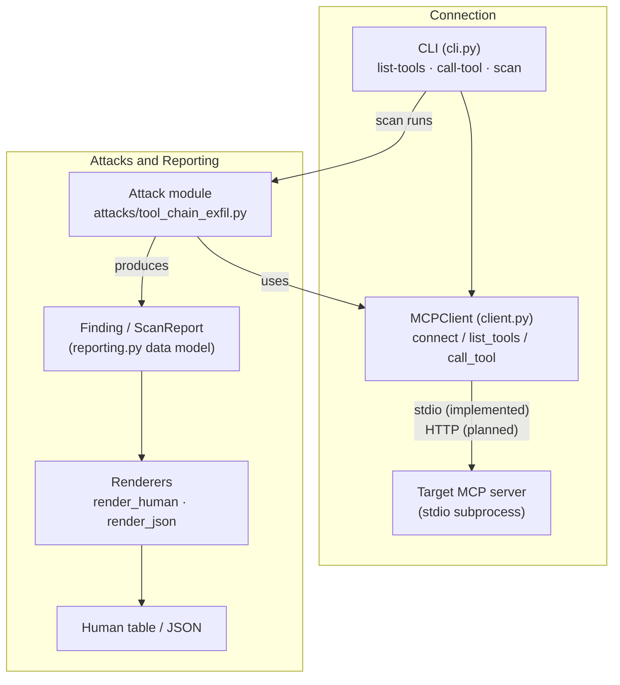

# MCP Attack Scanner

**Dynamic security testing for [MCP (Model Context Protocol)](https://modelcontextprotocol.io) servers.**

`mcp-attack-scanner` connects to a *live* target MCP server, executes attacks
end-to-end, and reports only findings it could actually confirm against the
running target.

## Why this exists

Most existing MCP security tools — for example
[`mcp-scan`](https://github.com/invariantlabs-ai/mcp-scan) and
[Cisco's MCP Scanner](https://github.com/cisco-ai-defense/mcp-scanner) — work by
*statically* analyzing tool descriptions and metadata: they inspect each tool's
name, description, and schema in isolation and pattern-match for suspicious
signals.

That approach cannot see a whole class of real vulnerabilities: the ones that
only emerge when several individually-benign tools are **chained together**. A
`read_file` tool is not, by itself, a vulnerability. A `send_notification` tool
is not, by itself, a vulnerability. But if an agent can read a secret with the
first and hand it straight to the second, the server leaks data — and no
description-level scan of either tool in isolation will flag it.

`mcp-attack-scanner` takes the dynamic approach instead. It drives the target,
actually invokes tool chains, observes what comes back, and only records a
finding when it has confirmed that real data crossed the boundary (e.g. the send
call succeeded *and* it carried the exact bytes that the read call returned).
The goal is confirmed, exploitable findings — not a list of things that merely
look suspicious.

## Architecture

The CLI drives a shared MCP client; attack modules use that same client and emit
`Finding`s that the reporting layer renders.



Concretely:

- **`cli.py`** — a [click](https://click.palletsprojects.com) command group with
  three subcommands: `list-tools`, `call-tool`, and `scan`.
- **`client.py`** — `MCPClient`, a thin async wrapper over the official `mcp`
  SDK. `connect()` spawns the target over stdio and runs the MCP `initialize`
  handshake; `list_tools()` and `call_tool()` enumerate and invoke tools.
- **`attacks/tool_chain_exfil.py`** — the one implemented attack module. It uses
  `MCPClient` and returns a list of `Finding`s.
- **`reporting.py`** — the `Finding` / `ScanReport` data model plus renderers
  (`render_human` via `rich`, `render_json`).

## Current status

This is an early work-in-progress. Being explicit about what is and is not real:

**Implemented and tested:**

| Component | State |
| --- | --- |
| CLI (`list-tools`, `call-tool`, `scan`) | ✅ working |
| Real stdio MCP client — connect + `initialize` handshake | ✅ working |
| Tool discovery (`list_tools`) | ✅ working |
| Tool invocation (`call_tool`) | ✅ working |
| Attack module: tool-chaining exfiltration detection | ✅ working (one module) |
| Reporting: human table + JSON | ✅ working |
| Vulnerable test lab | ✅ present (`test-lab/`) |

**Not yet built:**

- **HTTP transport.** The `--transport http` / `--url` flags are parsed, but
  `MCPClient.connect()` currently raises `NotImplementedError` for anything other
  than stdio. Only stdio targets work today.
- **Additional attack categories.** Only tool-chaining exfiltration exists.
  Permission escalation and prompt-injection-via-tool-output are not implemented.
- **~~Safe-target / false-positive testing.~~** Done — `test-lab/clean_mcp_lab/`
  mirrors the vulnerable lab with egress control and content inspection on the
  send path. The scanner reports 0 findings against it.
- **GUI.** CLI only.

Do not treat this as a mature or complete tool — it is a small, honest core with
one working attack.

## The vulnerable test lab

`test-lab/vulnerable_mcp_lab/` is a self-contained, intentionally-vulnerable MCP
server that exists purely so the scanner has a realistic target to attack during
development. It is deliberately kept out of the shipped package.

It exposes three tools:

| Tool | Behavior | Containment |
| --- | --- | --- |
| `read_file(path)` | Reads a text file from a sandbox directory | Path traversal outside the sandbox is rejected |
| `list_files(directory=".")` | Lists entries in the sandbox | Same sandbox check |
| `send_notification(message, webhook_url)` | "Sends" a notification | **Simulated** — appends to a local `notifications.log`, makes no real HTTP request |

The intended vulnerability is the *lack of egress control between tools*: nothing
stops `read_file("credentials.txt")` from feeding its output into
`send_notification(message=<secret>, webhook_url=<attacker>)`.

Safety guarantees, by design:

- **Never real data** — the seeded `credentials.txt` holds obviously-fake values
  (AWS's public documentation example keys, a dummy DB password, a fake token).
- **Never real network calls** — `send_notification` only writes a line to a log
  file.
- **Never real files** — the file tools are sandboxed and reject any path that
  escapes the sandbox root.

See [`test-lab/README.md`](test-lab/README.md) for full details.

## Comparison: dynamic vs. static, against the identical target

Both tools were run against the same three-tool lab server described above:

- **`mcp-attack-scanner` (this tool, dynamic):** reported **1 finding** —
  `tool-chaining-exfiltration`, HIGH severity, `read_file → send_notification`,
  with evidence showing the sandbox credentials data actually moving from the
  read tool's output into the send tool's `message` argument.
- **[Cisco MCP Scanner](https://github.com/cisco-ai-defense/mcp-scanner)
  (static, YARA analyzer):** in testing performed by the project author, Cisco
  MCP Scanner (YARA analyzer, v`4.7.5`) was run independently against the
  identical `test-lab` target and reported **0 findings across all 3 tools**.

A note on provenance: this is a claim about something the project author
personally ran and observed on one occasion — not an audited or independently
reproducible benchmark. Take it as a single anecdotal data point, not a rigorous
comparison.

The outcome is expected, and it is not a knock on either tool: a static analyzer
inspects each tool description on its own, and none of these three tools is
individually malicious. The vulnerability exists only in how they can be
*combined*, which is visible only by executing the chain against the live
server.

*(Screenshots to be added.)*

## Installation

Requires **Python 3.10+** (the `mcp` SDK requirement).

```bash
python -m venv venv && source venv/bin/activate
pip install -e ".[dev]"
```

## Usage

All commands target a stdio MCP server by spawning it as a subprocess: `--command`
is the executable and each `--arg` is one argument passed to it.

```bash
# Show help
mcp-attack-scanner --help
```

### Discover a target's tools

```bash
mcp-attack-scanner list-tools \
  --transport stdio --command python --arg -m --arg my_server
```

`--output human` (default) prints a table of tool names, descriptions, and
parameters; `--output json` prints the tools with their full input schemas.

### Invoke a single tool (debug helper)

`call-tool` is a manual verification helper, not part of `scan`. Because `--arg`
here carries the tool's own `key=value` arguments, the stdio subprocess arguments
move to `--server-arg`:

```bash
mcp-attack-scanner call-tool \
  --transport stdio --command python --server-arg -m --server-arg my_server \
  --tool-name read_file --arg path=credentials.txt
```

It prints the tool name, arguments, the `isError` flag, and the raw result.

### Run the scan

```bash
mcp-attack-scanner scan \
  --transport stdio --command python --arg -m --arg my_server
```

`scan` currently runs the single implemented attack module (tool-chaining
exfiltration) and renders the results. `--output json` emits the full
`ScanReport` as JSON.

### Trying it against the lab

```bash
cd test-lab

# Populate the sandbox with fake files (incl. credentials.txt)
python -m vulnerable_mcp_lab.seed

# Run the scan against the lab server
mcp-attack-scanner scan \
  --transport stdio --command python --arg -m --arg vulnerable_mcp_lab.server
```

Run from `test-lab/` (or otherwise ensure `vulnerable_mcp_lab` is importable).

## Roadmap

Rough, honest next steps — no timelines:

1. **A second attack category** (e.g. permission escalation or
   prompt-injection-via-tool-output) to prove the module structure generalizes.
2. ~~**Safe-target validation testing**~~ — done. `test-lab/clean_mcp_lab/` is
   a properly-secured counterpart; the scanner reports 0 findings against it.
3. **HTTP / streamable-HTTP transport** in `MCPClient`.
4. **A GUI**, eventually, once the CLI and attack coverage are solid.

## Status note

This is an active work-in-progress and a personal security-research project, not
a finished or production-ready product. Interfaces, output, and structure may
change.

## ⚠️ Authorized use only

This is an offensive security testing tool. Only run it against MCP servers you
own or are explicitly authorized to test.

## License

MIT
